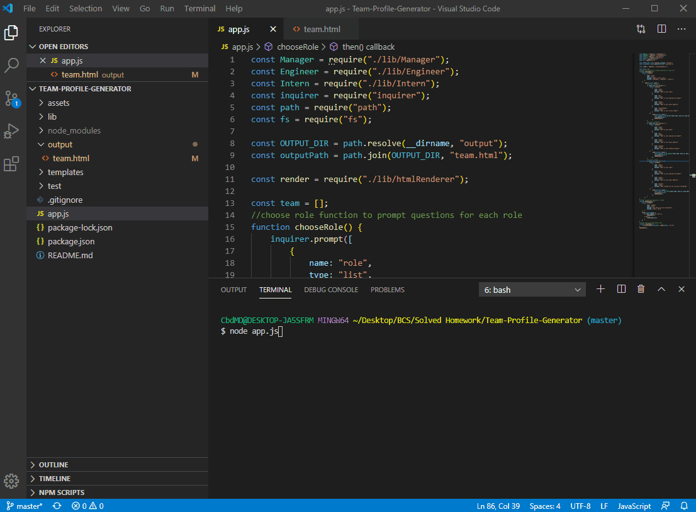

# Team-Profile-Generator


# Description 
An application to dynamically create a Team Profile file from command line prompts. Using the three categories: Manager, Engineer and Intern, add as many employees as you have.

# Demo


# Table of Contents

1. [Installation](#Installation)
2. [Usage](#Usage)
3. [License](#License)
4. [Tests](#Tests)
5. [Questions](#Questions)

## Installation
To install run the code below in the terminal

```
npm i
```

## Usage
To use this on your local machine fork and then clone. Run the test command and the run 'node app.js' on the command line in the terminal. Add as many employees that you have within the three categories.

## License
MIT

## Contributing
Samantha Morrison

## Tests

To install run the code below in the terminal

```
npm run test
```

## Questions
Please direct questions to [sm-pixel](github.com/sm-pixel) or email [ms.samantha.marie.86@gmail.com](mailto:ms.samantha.marie.86@gmail.com)
  